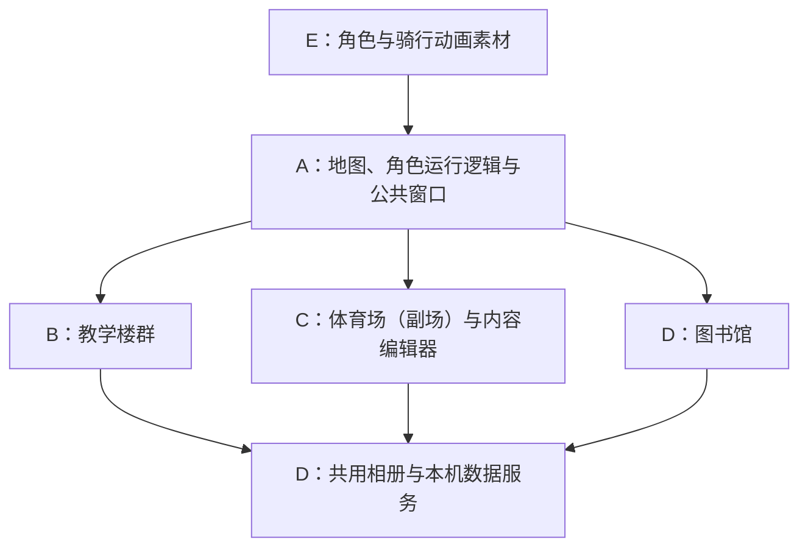

# A–E 开发分工与交付规范

版本：1.0.0  
日期：2026-09-26  
范围：一个公共校园框架、三个地点模块、统一角色素材库；本文件不是已完成开发的记录。

## 一、共同目标与协作入口

共同交付一套本机浏览器应用：用户在连续校园地图上步行或骑行，只在潇湘图书馆、教学楼群和体育场（副场）触发功能，三个地点共用图片上传及相册能力。本文“操场”均指该副场；体育场（鸟巢）及其他运动场不提供场景功能或相册入口。

先阅读 [文档入口](README.md) 和 [共享类型](contracts/campus-v1.d.ts)，再阅读各自负责的专项文档。任何人不以显示名称或屏幕坐标代替固定 placeId，不另建相册或公共内容保存协议。

## 二、职责和交付

| 工作线 | 负责内容 | 必交成果 | 依赖与边界 |
|---|---|---|---|
| A：地图与公共框架 | 场景初始化、PNG 接入、标注适配、移动/骑行、碰撞遮挡、镜头、输入暂停、地点注册、导航标记和集成 | 可运行公共框架、经检查的地图数据、公共地点窗口、角色接入、端到端记录 | 接入 E 的素材；不让地点组件修改 Phaser 场景内部状态 |
| B：教学楼群 | 课程表单、周课表、周次/单双周、楼座筛选、CSV、IndexedDB 和课表备份 | 接收统一 props 的 TeachingPanel、个人课表模块及其验证记录 | 楼座目录由 A 提供；相册用 D 的 PlaceGallery；私人课表不上传本机公共服务 |
| C：体育场（副场）与编辑器 | 社团目录、活动筛选/日期状态/地点展示，以及本地可视化编辑器 | StadiumPanel、内容编辑器、与 D 公共内容 API 的联调记录 | 只调用统一读写 API；不直接写文件，不维护另一份照片索引；不为鸟巢或其他运动场增加交互 |
| D：图书馆、相册与服务 | 图书馆介绍、图片上传/查看、共用相册、公共内容与图片落盘、服务错误处理 | LibraryPanel、PlaceGallery、统一 API 客户端和本机服务、持久化验证 | 不接管课表存储；不擅自扩展照片删除、说明或排序功能 |
| E：角色设计与动画素材 | 人物和电动车外观、四方向步行/骑行的待机和移动动画、来源记录 | 设计样张、透明 PNG 精灵图、符合契约的 manifest、预览及来源说明 | A 负责速度、碰撞和状态切换；E 不改键盘、地图坐标或场景逻辑 |

“负责建筑”表示负责该地点的功能组件，不是各自重做一张校园地图。地点内部首版是图片背景及功能界面，不新增自由行走的室内场景。

## 三、未来工程目录和唯一维护人

以下目录为后续工程约定，本次文档编写不创建应用代码或用户数据。

| 目录/文件范围 | 唯一维护人 | 说明 |
|---|---|---|
| `src/app/`、`src/game/`、`src/shared/ui/` | A | 公共窗口、场景与基础样式 |
| `src/shared/contracts.ts`、地点注册表、公共目录 provider | A | 初始化时从文档类型契约落地；变更需通知相关成员 |
| `public/maps/`、`assets/maps/`、`tools/map/` | A | 运行副本、遮挡与 Tiled 标注、统一转换适配 |
| `src/features/teaching/` | B | 课表界面、存储和解析逻辑 |
| `src/features/stadium/`、`src/features/content-editor/` | C | 社团活动查询和内容编辑 |
| `src/features/library/`、`src/shared/gallery/`、`src/shared/api/`、`server/` | D | 图书馆、复用相册和所有公共文件服务 |
| `assets/characters/<character-id>/`、`public/characters/<character-id>/` | E；A 接入运行副本 | 每角色独立保存分阶段素材；角色清单在 `assets/characters/README.md`，遵循角色接口和目录规范 |
| 根 package.json、lockfile、构建/测试/代理配置、应用入口 | A | B/C/D/E 提供依赖需求，由 A 一次合入，不各自改版本 |
| `data/` | D 维护存储实现 | 运行数据不提交到 Git；测试数据每个开发目录独立 |

各成员可维护所属目录内的测试。公共浏览器集成测试由 A 维护；出现服务或相册故障由 D 修复，出现业务逻辑故障由 B/C 修复。

接口文件实际落入工程后应保持单一运行时来源，文档中的声明是协议参考，不能让两个运行时类型文件各自演进。

## 四、并行开始前统一的接口

### 4.1 地点注册

| placeId | featureKey | 页面组件 | 页面负责人 |
|---|---|---|---|
| `xiaoxiang_library` | `library` | LibraryPanel | D |
| `xiaoxiang_teaching_group` | `teaching` | TeachingPanel | B |
| `xiaoxiang_sports_ground`（体育场副场） | `stadium` | StadiumPanel | C |

A 独占注册表。图片、入口和业务引用固定 placeId；课程楼座使用另一个稳定 buildingId。A 提供空的待核验楼座目录时，B 显示未关联状态，不能自编真实楼座或坐标。

### 4.2 地点组件与公共页面宿主

统一流程为靠近地点并进入互动范围、显示 E 键提示、按 E 跳转对应功能页面。技术上在同一应用内切换独立页面视图，保留并暂停地图会话。本文“公共窗口”及 `Panel` 组件命名沿用现有接口，指功能页面的宿主和组件，不要求页面呈现为小弹窗。

三个地点组件都接收 `PlacePanelProps`：

| 字段 | 用途 |
|---|---|
| `place` | 固定地点身份、名称及 featureKey |
| `sessionId` | 本次打开窗口的会话编号，避免异步回调作用到已经关闭的窗口 |
| `buildings` | A 提供的已登记楼座目录；教学楼模块使用，其他模块可忽略 |
| `onRequestClose()` | 请求宿主关闭窗口；组件不能自己恢复角色或随意切换场景 |
| `onLocate(target)` | 请求标记 place/building/landmark，返回 marked、unmapped 或 unknown-target |
| `registerCloseGuard(guard)` | 表单有未保存修改等情况时注册关闭检查，返回注销函数 |

A 的场景仅在角色处于有效互动范围且新按下 E 时，通过 `request-open-place` 事件传入 `{placeId}` 请求跳转页面。角色不必精确踩中 `entrancePoint`；该点保留作定位与目标选择参考。由宿主校验当前互动目标、创建 sessionId、暂停移动和保存返回上下文。范围外、长按重复事件及页面表单中的 E 不触发地图互动。模块不得通过自建浏览器事件、全局变量或操作 Phaser 实例绕开宿主。

“返回校园”按钮、将来确定的退出快捷键和其他关闭途径统一经过关闭检查。确认关闭后清除按键及速度，恢复按 E 时的原室外位置与朝向，不强制移动到入口参考点。模块卸载时注销检查和订阅，不保留失效 sessionId 的回调。

`onLocate` 仅更新目标标记和展示地图总览，不自动传送或关闭地点界面；关闭总览后返回地点界面。任何一层查询窗口仍打开时，角色保持暂停。

### 4.3 共用相册

B、C、D 均嵌入 `PlaceGallery`，其公共参数为 `GalleryProps {placeId}`。D 统一封装相册列表、单张上传和图片读取，其他模块不直接依赖磁盘路径或照片索引结构。

教学楼群切换楼座时，传给相册的 placeId 不变。界面打开、选图和大图预览期间，公共宿主输入锁持续有效。

### 4.4 内容与角色

C 与 D 按 [本机数据接口](03_本机数据接口.md) 使用同一公共内容快照。编辑器保存成功使用响应快照更新当前客户端，查询入口重新读取最新快照。

E 与 A 按 [角色素材接口](04_角色素材接口.md) 交付 16 个状态入口及帧元数据。尺寸、帧数和锚点由 manifest 提供；角色设计外观和地图显示比例仍需实际预览确认。

## 五、并行顺序与阶段门槛

### P0：建立共同基线

A 建立统一工程、依赖版本、类型契约、地点注册、公共窗口和开发预览入口；D 同步实现 API 客户端的接口替身和能力声明；E 提供角色方向样张。

本目录当前未初始化 Git。后续开始代码阶段时，先建立共享基线，再按工作线使用独立分支及 worktree/工作目录。分支可采用 `codex/campus-a-core`、`codex/campus-b-teaching` 等名称。多人不能同时在同一 checkout 编辑共享文件。本次没有创建分支、提交或推送。

P0 通过条件：三个地点能够按固定 ID 在开发预览中加载同一规格的窗口；共享声明可编译；错误和空状态接口可模拟。开发预览仅限开发模式，不作为正式用户绕过地点查询的入口。

### P1：五条工作线并行

- A 标注可通行区域及三处交互，使用明确标注的临时角色调试；等待入口核验期间使用独立测试场景。
- B 在开发预览中完成课表逻辑、表单和浏览器保存。
- C 完成社团活动界面、编辑器及快照格式验证。
- D 完成图库、本机服务和图书馆界面，提供真实保存能力给 B/C 联调。
- E 先交方向样张与地图合成预览，外观及比例确认后完成动画素材包。

在并行过程中，A 与 D 优先打通图书馆的一条最小链路：进入已标定互动范围或明确的测试范围 → 按 E → 跳转图书馆页面 → 真实上传图片 → 返回原位置。B/C 无需等待这条链路全部完成才开始业务开发。

接口替身、临时地图和临时人物必须标明用途；通过模拟测试不等于真实文件保存、真实地图或角色美术验收通过。

### P2：逐项集成

A 负责按依赖接入 D 的真实服务、B 教学楼、C 操场及 E 角色。每合入一项检查同一条进入/退出链路，再接下一项；不要等五条线全部完成后一次合并。

根配置和共享接口由 A 合并，其他成员提供变更建议。跨模块不兼容变更先更新契约版本并同步调用方；不得用临时兼容字段掩盖未同步的接口。

### P3：分层验收

分别记录文档/结构校验、单元逻辑、浏览器功能、真实文件持久化、地图连通和地理核验、人物美术检查。不能只记录“启动成功”。

## 六、交付时必须附带的内容

每条工作线提交：所改文件范围、使用的接口版本、运行或预览方式、已验证结果、未验证项及其影响、是否使用临时素材/测试数据。不得把需要其他成员完成的事项标记为本线已通过。

| 工作线 | 必须覆盖的验收场景 |
|---|---|
| A | 三处范围内按 E 正确跳转、范围外和长按不误触发、输入锁/失焦、返回原触发位置、地图缩放对齐、步行与骑行碰撞、跨校区连通、遮挡 |
| B | 节次与单双周、未知楼座保留、错误导入保护、刷新保存、地图定位结果提示、教学楼相册 ID 不随楼座变化 |
| C | 关键词/类别/日期/校区筛选、已结束状态、实际活动地点、保存失败保留草稿、版本冲突不覆盖新内容 |
| D | 三个相册隔离、单张上传及重复请求、失败不破坏旧文件、重启和跨浏览器读取、公共内容落盘 |
| E | 16 个状态、透明背景、帧范围、脚底/车轮锚点、动画稳定、切换步行与骑行无位置跳变 |

端到端测试至少包括：进入图书馆上传后返回；到操场确认没有图书馆图片；到教学楼录入课程；刷新及重启后复查；用另一个浏览器确认相册共用而个人课表独立；输入表单、选择图片、切换窗口时角色停止。

地图需要额外检查桥面可走、桥外水面阻挡、骑行不会穿过窄障碍，以及所有入口和安全点的完整脚底碰撞体可站立。

## 七、尚不能伪造的输入

真实入口、楼座清单、出生/传送点、角色设计外观、移动参数、图片政策及课表规则未齐时，按需求中的缺失状态处理。操场场地已选定为体育场（副场），但其坐标和地理核验尚未完成。共同接口可以先完成；依赖这些值的正式验收应明确保留待完成状态。
